# Gauntlet (1985) Graphics

This repository provides sprite sheets for Atari's 1985 Gauntlet (rev 14).
Currently, monsters, players, and dungeon items/effects are available.
The dungeon playfield (blocks, floors, etc.) is not included.

See [releases](https://github.com/mbeisser1/gauntlet_mame_gfx/releases) for downloads.

If you are interested in how graphics, like the player sprites below, were ripped from the arcade ROMs then read on.

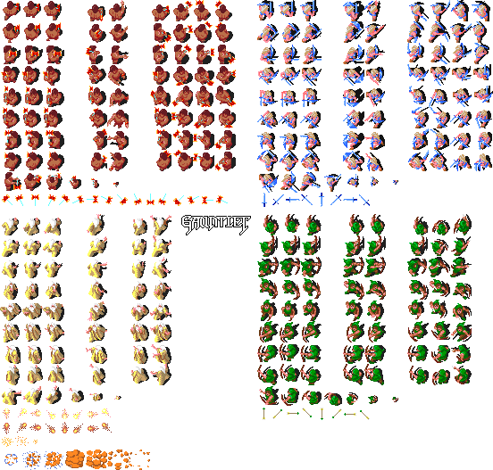

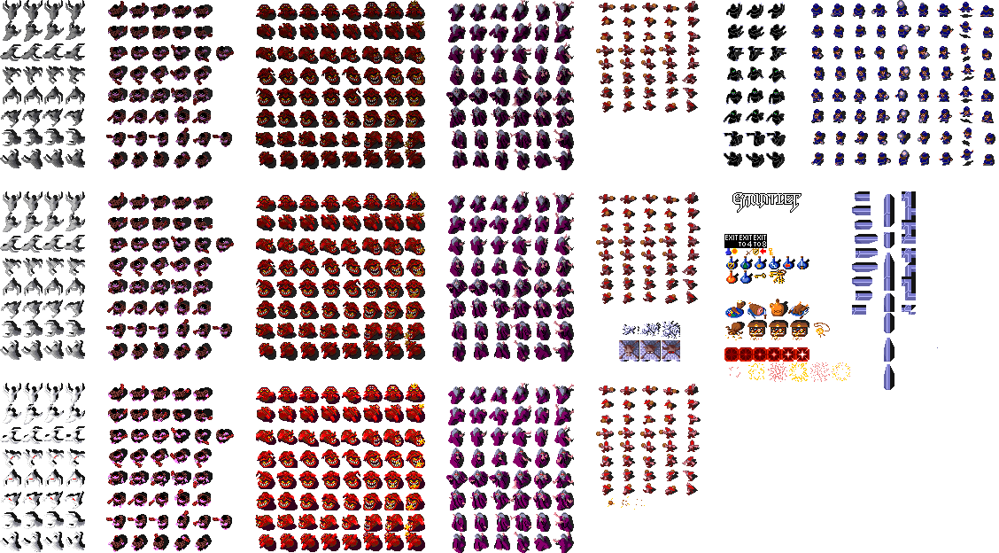

## Table of Contents

- [Gauntlet (1985) Graphics](#gauntlet-1985-graphics)
  - [Table of Contents](#table-of-contents)
  - [Repository](#repository)
    - [Repository Layout](#repository-layout)
  - [Ripping Sprites](#ripping-sprites)
  - [MAME](#mame)
    - [Gauntlet Romset](#gauntlet-romset)
    - [Tile Palettes](#tile-palettes)
    - [Tile Viewer](#tile-viewer)
  - [Graphics EPROM storage](#graphics-eprom-storage)
    - [Potential Graphics Chips](#potential-graphics-chips)
    - [Text Sprites](#text-sprites)
    - [Verify EPROMs With MAME](#verify-eproms-with-mame)
  - [Sprite Data](#sprite-data)
    - [Planar Graphics](#planar-graphics)
      - [Two Graphics Layouts](#two-graphics-layouts)
    - [Motion Object and Playfield Graphics: 4BPP Planar](#motion-object-and-playfield-graphics-4bpp-planar)
      - [EPROM-to-Plane Mapping](#eprom-to-plane-mapping)
    - [Alphanumeric Graphics: 2BPP Planar](#alphanumeric-graphics-2bpp-planar)
    - [4BPP Export Script](#4bpp-export-script)
    - [2BPP Text Export Script](#2bpp-text-export-script)
    - [Palette Format](#palette-format)

## Repository

*If you just want the sprite sheets, head over to the [releases](https://github.com/mbeisser1/gauntlet_mame_gfx/releases).*

To start, you'll need a Gauntlet romset for MAME (version 0.191 or newer).

1. Extract the Gauntlet romset to the `rom` directory.
1. Run the python scripts in the `scripts` directory:
    1. To extract the majority of the sprites:
       1. `python3 gauntlet_4bpp_planar_tiles.py`
    1. To extract the character and text data:
       1. `python3 gauntlet_alpha_numeric_2bpp_linear_tiles.py`
1. Open the 2 output `.bin` files in a tile editor.

### Repository Layout

```text
.
├── docs/               # Reference graphics format docs
│   └── img/            # Screenshots used in the docs
├── gfx/                # 
│   ├── palette/        # Gauntlet palette data
│   └── sprites/        # Finished sprite sheets exported from the ROM
├── manuals/            # Scanned PDFs of original Gauntlet arcade docs and a PCB photo
├── rom                 # REQUIRED - Extract Gauntlet MAME romset here 
└── scripts/            # Export scripts for sprites - 4BPP and 2BPP tile extraction
```

## Ripping Sprites

Ripping sprites from arcade games is fundamentally different from ripping sprites from console games.
Console ROMs typically store graphics and game code in a single EPROM, whereas arcade cabinets distribute code and graphics across multiple EPROMs.
Since arcade graphics are stored on separate chips and tailored to specific hardware, standard console sprite extraction tools like [Tile Layer Pro](https://www.romhacking.net/utilities/108/), [Tile Molester](https://github.com/toruzz/TileMolester), or [YY-CHR](https://www.romhacking.net/utilities/119/) can't parse the data correctly, because the graphics format doesn't match what these tools expect.

## MAME

Gauntlet is easily played through [MAME](https://www.mamedev.org/).
Unlike many other emulators, specific MAME versions require compatible MAME ROMs*, and newer MAME versions are often unable to play older romsets.
Gauntlet is no exception to this rule.
MAME version 0.191, released Oct 24, 2017, correctly fixed the required size of the 136037-104 (6p) EPROM chip and [broke backward compatibility](https://davidhouchin.com/posts/gauntlet/) with older Gauntlet romset dumps.

\* A MAME "ROM" is actually a romset, which is a compressed archive containing multiple files representing different chips (e.g., graphics, sound, program code).

### Gauntlet Romset

The Gauntlet romset contains the following files.
The file suffix is not a file extenstion and rather corresponds to the physical location of the chip on the PCB board.

- 136037-104.6p
- 136037-111.1a
- 136037-112.1b
- 136037-113.1l
- 136037-114.1mn
- 136037-115.2a
- 136037-116.2b
- 136037-117.2l
- 136037-118.2mn
- 136037-119.16s
- 136037-120.16r
- 136037-1307.9a
- 136037-1308.9b
- 136037-1409.7a
- 136037-1410.7b
- 136037-205.10a
- 136037-206.10b
- 74s287-136037-103.4r
- 74s472-136037-101.7u
- 74s472-136037-102.5l

### Tile Palettes

MAME has a tile palette viewer and tile viewer that can be used to view sprites.
View the [tile palette](https://wiki.mamedev.org/index.php/Using_the_GFX/TileMap_viewer_(F4)) by pressing F4.

|                                 Text Palette                                 |
|:----------------------------------------------------------------------------:|
| 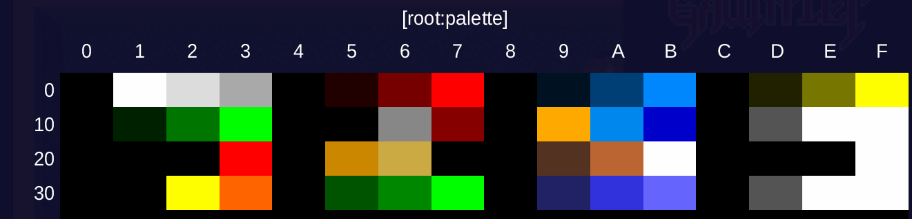 |

|                                 Sprite Palette                                  |
|:-------------------------------------------------------------------------------:|
| 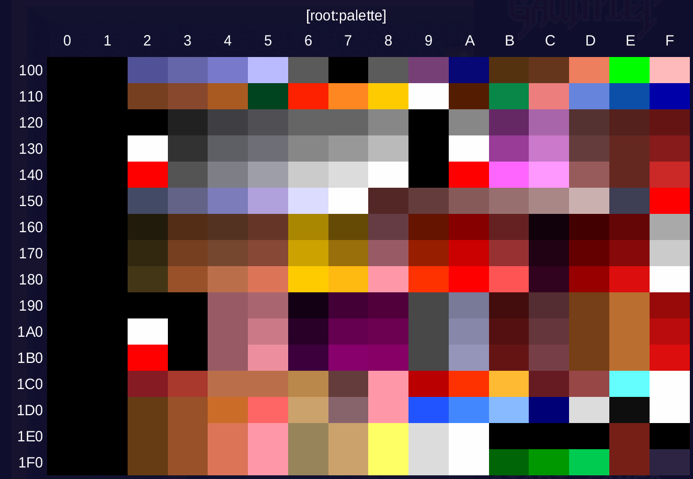 |

|                          Playfield (Background) Palette                           |
|:---------------------------------------------------------------------------------:|
| 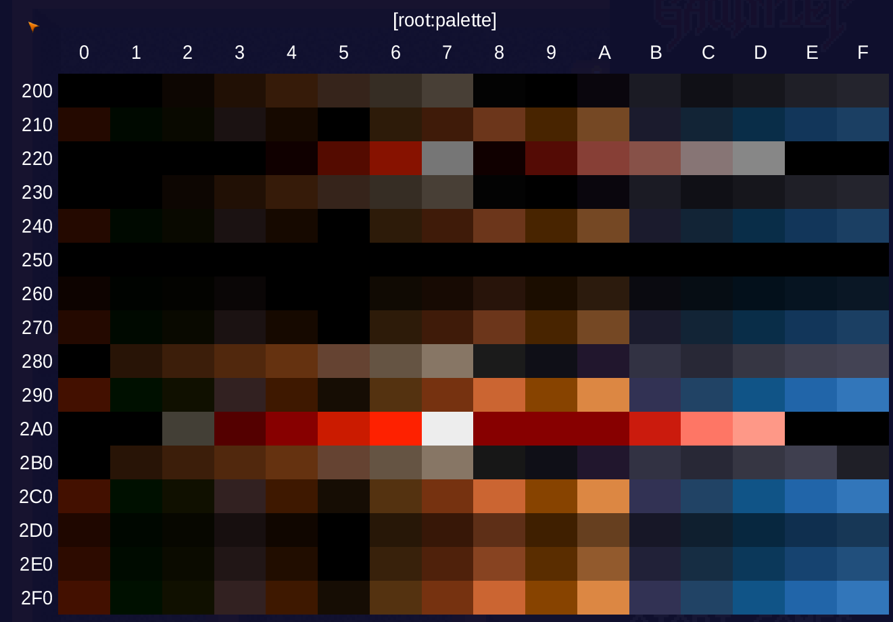 |

Scrolling through the palettes, we see 3 distinct sections.

1. The beginning 4 rows starting at offset 0x000.
2. The 16 rows of brighter colors starting at offset 0x100.
3. The 16 rows of darker / dull colors starting at offset 0x200.

It isn't obvious how to determine the different sections, but for now, note that Gauntlet has hundreds (not thousands) of colors associated with sprite tiles.

### Tile Viewer

Opening the [tile viewer](https://wiki.mamedev.org/index.php/Using_the_GFX/TileMap_viewer_(F4)) shows sprite tiles for the ghost monster, although the colors aren't quite right.
Pressing "\]" reveals a second set of sprite tiles in the form of letters, numbers, and icons.
Going back to the first tile set by pressing "\[", and scrolling down with the down arrow key, reveals tiles for other enemies, items, and characters in the game.

Gauntlet calls the 1st tile set motion objects sprites, and the 2nd tile set alphanumeric or character data.

| Tile Set 1 (Motion Object) | Tile Set 2 (Alphanumeric Data)|
|:-------:|:------:|
| 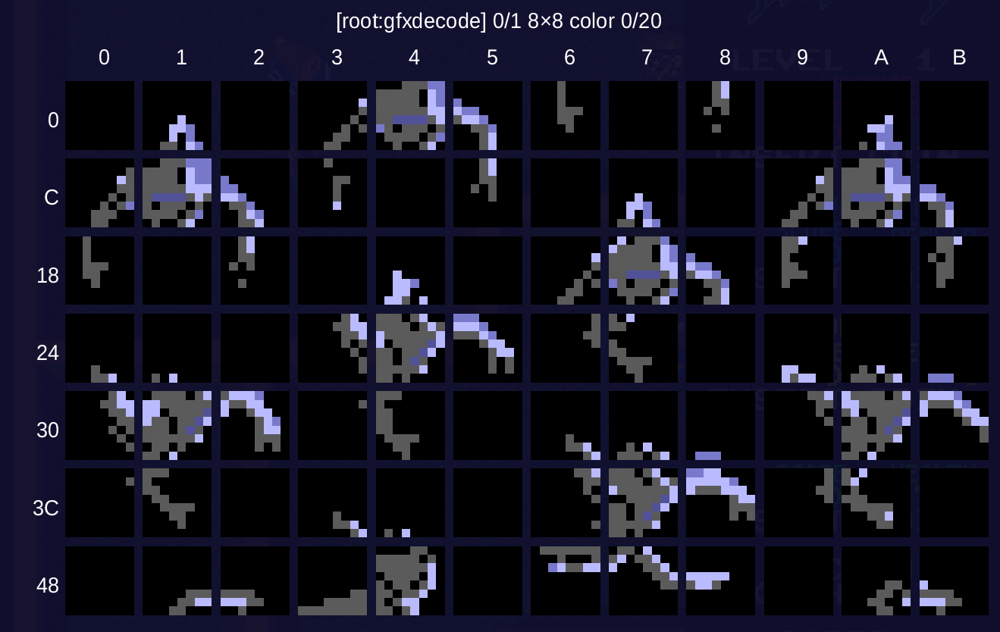 | 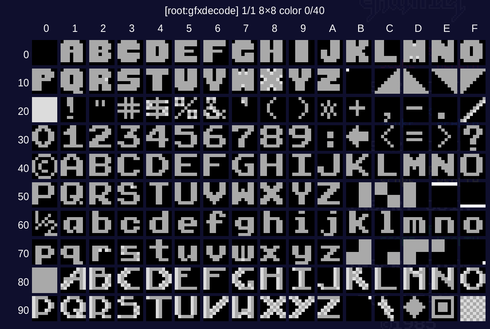 |

To "correctly" view some sprites we can cycle through the colors associated with those tiles.
Viewing the initial ghost, we see the initial colors are wrong.
If we keep changing the colors (arrow key right) the ghost transforms into the 3 different kinds seen in the game.

| Initial Palette | Palette 2 | Palette 3 | Palette 4 |
|:---------------:|:---------:|:---------:|:---------:|
| 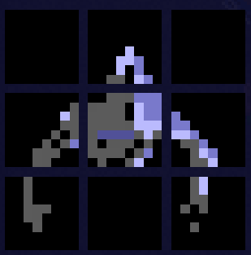 | 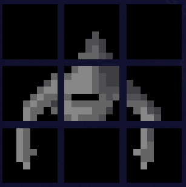 | 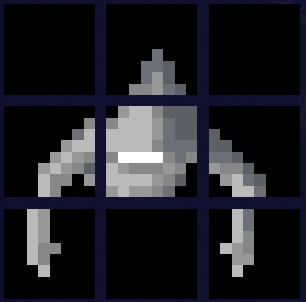 | 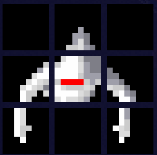 |

Each time we change the colors, we're changing the color palette used for that sprite.
Sprites in Gauntlet (and most 70s, 80s, and early 90s games) used [indexed color](https://en.wikipedia.org/wiki/Indexed_color) for their graphics.
This method allowed developers to store a single sprite in memory while enabling multiple color variants of that sprite.
The 3 different ghost types in Gauntlet all use the same sprite tiles, just rendered with different color palettes.

The tile viewer in MAME is fine for viewing sprites, but it isn't well suited for ripping sprites into sprite sheets.
We want a way to group the 8x8 tiles as shown in the image below so we can export them.


## Graphics EPROM storage

The graphics and game code are stored on EPROMs, but which ones?
Pages 5-21 through 5-24 of the PCB Part List in the [Gauntlet Arcade Manual](https://github.com/mbeisser1/gauntlet_mame_gfx/blob/main/manuals/Gauntlet__1985__Operators__Manual.pdf) list the following EPROMs:

| Designator | Part Number | Usage                  |
|------------|-------------|------------------------|
| 1A         | 136037-111  | graphics               |
| 1B         | 136037-112  | graphics               |
| 1L         | 136037-113  | graphics               |
| 1M/N       | 136037-114  | graphics               |
| 2A         | 136037-115  | graphics               |
| 2B         | 136037-116  | graphics               |
| 2L         | 136037-117  | graphics               |
| 2M/N       | 136037-118  | graphics               |
| 6P         | 136037-104  | alpha numeric graphics |
| 7A         | 136037-109  | main cpu               |
| 7B         | 136037-110  | main cpu               |
| 9A         | 136037-107  | main cpu               |
| 9B         | 137037-108  | main cpu               |
| 10A        | 136037-105  | main cpu               |
| 10B        | 136037-106  | main cpu               |
| 13/14A     | 137329-450  | N/A                    |
| 16R        | 136037-120  | audio                  |
| 16S        | 136037-119  | audio                  |

This list is a subset of the files in the Gauntlet romset, and shows what the EPROM is used for.
But how do we know this information?
To answer that, let's look at the [Gauntlet Schematic](https://github.com/mbeisser1/gauntlet_mame_gfx/blob/main/manuals/Gauntlet__1985__Schematic.pdf).

### Potential Graphics Chips

The signal glossary of the schematic reveals a few sure fire clues about the graphics EPROMs:

- GCS0-GCS5 - Graphics ROMs chip select
- GLD - Graphics load (to SLAG chips)
- GRH/L - Graphics ROM high/low select (A14 on a 27256)

Checking sheets 11 and 12 of the schematic diagram, we find 24 EPROMs connected to a SLAG chip, and the GCS and GRH/L signals are linked to EPROM chips.
Planes 0 through 3 are also shown on the left side of the schematic pages, indicating that specific EPROMs store specific bitplanes for planar graphics.
These are definitely our graphics chips.

But do we actually have 24 graphics EPROMs?
No.
The schematic shows what the PCB board layout supports, not what is actually on the game boards.
Cross referencing the schematic diagram with the physical PCB board shows 8 EPROMs for graphics: 1A, 1B, 1L, 1M/N, 2A, 2B, 2L, and 2M/N.


### Text Sprites

The signal glossary also shows:

- ALC3, ALC4 - Alphanumerics palette data bits 3 and 4
- APIX0, APIX1 - Alphanumeric pixel data

In older games, it was common to store text and letters as sprite data which we saw in the tile viewer earlier.

Checking sheet 15 of the schematic shows EPROM 6P directly connected to two other chips with the APIX0/1 signals. Additionally the ALC3/4 signals are being fed intot the 6P.
6P is our alphanumeric graphics data.


### Verify EPROMs With MAME

To verify our assumptions about EPROMs, we can check the MAME [gauntlet.cpp](https://github.com/mamedev/mame/blob/e776c98438a465d3486c367cbad3777a6eb7902e/src/mame/atari/gauntlet.cpp#L897) code for Gauntlet.
MAME has already done the hard work of identifying chips and what they are used for!

```cpp
// ROM definition(s)
ROM_START( gauntlet )
    ROM_REGION( 0x80000, "maincpu", 0 )
    ROM_LOAD16_BYTE( "136037-1307.9a",  0x008000, 0x004000, CRC(46fe8743) SHA1(d5fa19e028a2f43658330c67c10e0c811d332780) )
    ROM_CONTINUE(                       0x000000, 0x004000 )
    ROM_LOAD16_BYTE( "136037-1308.9b",  0x008001, 0x004000, CRC(276e15c4) SHA1(7467b2ec21b1b4fcc18ff9387ce891495f4b064c) )
    ROM_CONTINUE(                       0x000001, 0x004000 )
    ROM_LOAD16_BYTE( "136037-205.10a",  0x038000, 0x004000, CRC(6d99ed51) SHA1(a7bc18f32908451859ba5cdf1a5c97ecc5fe325f) )
    ROM_LOAD16_BYTE( "136037-206.10b",  0x038001, 0x004000, CRC(545ead91) SHA1(7fad5a63c6443249bb6dad5b2a1fd08ca5f11e10) )
    ROM_LOAD16_BYTE( "136037-1409.7a",  0x048000, 0x004000, CRC(6fb8419c) SHA1(299fee0368f6027bacbb57fb469e817e64e0e41d) )
    ROM_CONTINUE(                       0x040000, 0x004000 )
    ROM_LOAD16_BYTE( "136037-1410.7b",  0x048001, 0x004000, CRC(931bd2a0) SHA1(d69b45758d1c252a93dbc2263efa9de1f972f62e) )
    ROM_CONTINUE(                       0x040001, 0x004000 )
   
    ROM_REGION( 0x10000, "audiocpu", 0 )
    ROM_LOAD( "136037-120.16r",  0x004000, 0x004000, CRC(6ee7f3cc) SHA1(b86676340b06f07c164690862c1f6f75f30c080b) )
    ROM_LOAD( "136037-119.16s",  0x008000, 0x008000, CRC(fa19861f) SHA1(7568b4ab526bd5849f7ef70dfa6d1ef1f30c0abc) )
   
    ROM_REGION( 0x04000, "chars", 0 )
    ROM_LOAD( "136037-104.6p",   0x000000, 0x004000, CRC(6c276a1d) SHA1(ec383a8fdcb28efb86b7f6ba4a3306fea5a09d72) ) // 27128, second half 0x00
   
    // #define ROM_REGION(length,tag,flags)
    // Total rom region is 0x40000 bytes, named spr_tiles, and the bits of the rom region are inverted
    ROM_REGION( 0x40000, "spr_tiles", ROMREGION_INVERT )

    // 8 eproms are loaded into the spr_tiles rom region sequentially as shown by the increasing offset of 0x008000.
    // The CRC and SHA1 can be ignored for our purposes. They make sure the eprom dump is the what's expected for this
    // MAME version.
    // Offset calculation:
    //   0x000000 + 0x008000 = 0x008000
    //   0x008000 + 0x008000 = 0x100000
    //   0x100000 + 0x008000 = 0x180000
    //   etc...
    ROM_LOAD( "136037-111.1a",   0x000000, 0x008000, CRC(91700f33) SHA1(fac1ce700c4cd46b643307998df781d637f193aa) )
    ROM_LOAD( "136037-112.1b",   0x008000, 0x008000, CRC(869330be) SHA1(5dfaaf54ee2b3c0eaf35e8c17558313db9791616) )
    
    ROM_LOAD( "136037-113.1l",   0x010000, 0x008000, CRC(d497d0a8) SHA1(bb715bcec7f783dd04151e2e3b221a72133bf17d) )
    ROM_LOAD( "136037-114.1mn",  0x018000, 0x008000, CRC(29ef9882) SHA1(91e1465af6505b35cd97434c13d2b4d40a085946) )
    
    ROM_LOAD( "136037-115.2a",   0x020000, 0x008000, CRC(9510b898) SHA1(e6c8c7af1898d548f0f01e4ff37c2c7b22c0b5c2) )
    ROM_LOAD( "136037-116.2b",   0x028000, 0x008000, CRC(11e0ac5b) SHA1(729b7561d59d94ef33874a134b97bcd37573dfa6) )
    
    ROM_LOAD( "136037-117.2l",   0x030000, 0x008000, CRC(29a5db41) SHA1(94f4f5dd39e724570a0f54af176ad018497697fd) )
    ROM_LOAD( "136037-118.2mn",  0x038000, 0x008000, CRC(8bf3b263) SHA1(683d900ab7591ee661218be2406fb375a12e435c) )
   
    ROM_REGION( 0x500, "proms", 0 )
    ROM_LOAD( "74s472-136037-101.7u", 0x000, 0x200, CRC(2964f76f) SHA1(da966c35557ec1b95e1c39cd950c38a19bce2d67) ) // MO timing
    ROM_LOAD( "74s472-136037-102.5l", 0x200, 0x200, CRC(4d4fec6c) SHA1(3541b5c6405ad5742a3121dfd6acb227933de25a) ) // MO flip control
    ROM_LOAD( "74s287-136037-103.4r", 0x400, 0x100, CRC(6c5ccf08) SHA1(ff5dbadd85aa2e07b383a302fa399e875db8f84f) ) // MO position/size
ROM_END
```

Looking at the code, we see:

```cpp
#define ROM_LOAD(name,offset,length,hash)
```

The `spr_tiles` `ROM_REGION` shows 8 `ROM_LOAD` entries with string names corresponding to the 8 EPROMs we previously identified for use as motion object sprite tiles".
Additionally, the `ROM_LOAD` call for `136037-104.6p` in the `chars` `ROM_REGION` confirms that we correctly identified the EPROM used for text.

## Sprite Data

Now that the graphics EPROMs have been identified, we can again use MAME's `gauntlet.cpp` code to decode the graphics storage.
The following code defines how the `spr_tiles` and `chars` data is defined.

*Note:* The `gauntlet.cpp` code can be intimidating at first because it emulates hardware.
Luckily, we don't need to understand all the details, and we're only interested in a few data structures.
Copious comments have been added for clarity.

```cpp
gfx_layout gfx_8x8x4_planar =
{
    // 8x8 pixel tiles
    8, 8,

    // total number of tiles in the region:
    // RGN_FRAC(1,4) means "use 1/4 of the graphics region per plane".
    // With 4 planes, the total region is divided into 4 equal parts.
    // Each part contains tiles for one bitplane.
    RGN_FRAC(1,4),

    // 4 bitplanes per pixel => 16 colors per pixel (2^4 = 16).
    4,

    // plane offsets: the 4 bitplanes are stored in separate regions.
    // Plane 3 (MSB): quarter 3 of the region
    // Plane 2:       quarter 2 of the region
    // Plane 1:       quarter 1 of the region
    // Plane 0 (LSB): quarter 0 of the region
    { RGN_FRAC(3,4), RGN_FRAC(2,4), RGN_FRAC(1,4), RGN_FRAC(0,4) },

    // x offsets for the 8 pixels of a row.
    // STEP8(0,1) = { 0, 1, 2, 3, 4, 5, 6, 7 }
    // Each pixel is one bit position in the row byte.
    { STEP8(0,1) },

    // y offsets for the 8 rows of a tile.
    // STEP8(0,8) = { 0, 8, 16, 24, 32, 40, 48, 56 }
    // Each row is 8 bits apart (one byte per plane per row).
    { STEP8(0,8) },

    // distance in bits between the start of one tile and the next,
    // WITHIN EACH PLANE. Since planes are stored separately (RGN_FRAC),
    // each plane stores 8 bytes (64 bits) per tile. With 4 planes total,
    // a complete 4BPP tile requires 32 bytes (256 bits) across all planes.
    8*8
};

gfx_layout anlayout =
{
    // 8x8 pixel tiles
    8, 8,

    // total number of tiles (8x8 tile) in the region:
    // RGN_FRAC(1,1) means "use the full graphics region".
    // This is a special encoded value and not a count. 
    // See: digfx.cpp, IS_FRAC, and FRAC_DEN
    RGN_FRAC(1,1),

    // 2 bitplanes per pixel => 4 colors per pixel.
    // plane1 is the high nibble of each row byte group
    // plane0 is the low nibble of each row byte group
    2,

    // plane offsets: the two bitplanes are interleaved in each byte.
    // plane 0 starts at bit 0, plane 1 starts at bit 4.
    { 0, 4 },

    // x offsets for the 8 pixels of a 16-bit (2 byte) row.
    // For pixel 0-3 the bit positions are 0..3 in the first byte.
    // For pixel 4-7 the bit positions are 8..11 in the second byte.
    // The corresponding bits for plane 1 are the same offsets + 4.
    { 0, 1, 2, 3, 8, 9, 10, 11 },

    // y offsets: each row is separated by 16 bits (2 bytes).
    // This is because each 8-pixel row consumes one byte per plane,
    // so 2 planes = 16 bits per row.
    { 0*16, 1*16, 2*16, 3*16, 4*16, 5*16, 6*16, 7*16 },

    // distance in bits between the start of one tile and the next.
    // 8 rows * 16 bits per row = 128 bits per tile.
    8*16
}; 

struct gfx_layout
{
    u16        width;              // pixel width of each element
    u16        height;             // pixel height of each element
    u32        total;              // total number of elements, or RGN_FRAC()
    u16        planes;             // number of bitplanes
    u32        planeoffset[MAX_GFX_PLANES]; // bit offset of each bitplane
    u32        xoffset[MAX_GFX_SIZE]; // bit offset of each horizontal pixel
    u32        yoffset[MAX_GFX_SIZE]; // bit offset of each vertical pixel
    u32        charincrement;      // distance between two consecutive elements (in bits)
    const u32* extxoffs;           // extended X offset array for really big layouts
    const u32* extyoffs;           // extended Y offset array for really big layouts
};

// these macros are used for declaring gfx_decode_entry info arrays
#define GFXDECODE_START( name ) const gfx_decode_entry name[] = {
#define GFXDECODE_END { 0 } };
#define GFXDECODE_ENTRY(region,offset,layout,start,colors) { region, offset, &layout, start, colors, 0 },

struct gfx_decode_entry
{
    const char*     memory_region;      // memory region where the data resides
    u32             start;              // offset of beginning of data to decode
    const gfx_layout* gfxlayout;        // pointer to gfx_layout describing the layout; nullptr marks the end of the array
    u16             color_codes_start;  // offset in the color lookup table where color codes start
    u16             total_color_codes;  // total number of color codes
    u32             flags;              // flags and optional scaling factors
};

// From header:
//  Address Range      Palette Range      Entries    Description
//  --------------------------------------------------------------------------
//  910000-9101FF         0-255             256      Alphanumerics (text) palette RAM
//  910200-9103FF       256-511             256      Motion object (sprite) palette RAM
//  910400-9105FF       512-767             256      Playfield palette RAM
//  910600-9107FF      768-1023             256      Extra palette RAM
GFXDECODE_START( gfx_gauntlet )
    // 4BPP planar (4 separate plane regions).
    // Palette offset starting at 256: Motion object colors occupy palette entries 256-511.
    // 32 color banks: Each tile can select one of 32 banks, with 16 colors per bank.
    GFXDECODE_ENTRY( "gfx2", 0, gfx_8x8x4_planar,  256, 32 )

    // 2BPP planar (interleaved plane regions)
    // Palette offset 0: Alphanumeric colors occupy palette entries 0-255.
    // 64 color banks: Each tile can select one of 64 banks, with 4 colors per bank.
    GFXDECODE_ENTRY( "gfx1", 0, anlayout,            0, 64 )
GFXDECODE_END
```

### Planar Graphics

The following sections require knowledge of the planar graphics format.
If you are new to planar graphics, I recommend any graphics tutorials for the NES, SNES, Sega Master System, or Sega Genesis as they all use planar graphics.

If you're not sure where to start, try here:

- [Graphics & Palettes - Super Nintendo Entertainment System Features Pt. 01](https://www.youtube.com/watch?v=57ibhDU2SAI)
- [SNES Assembly Adventure 03: Creating Your First Sprite](https://georgjz.github.io/snesaa03/)

#### Two Graphics Layouts

The driver registers two tile layouts:

- `gfx_8x8x4_planar`: 8x8 tiles at 4BPP for playfield tiles and motion objects
- `anlayout`: 8x8 tiles at 2BPP for the alphanumeric overlay

Those 8x8 tiles are the basic building blocks for everything MAME shows in the tile viewer.
Sprites and environment pieces are built by combining multiple tile together.
For example, a 16x16 motion-object block is four adjacent 8x8 tiles, and player or monster sprites stitch multiple such blocks together.

### Motion Object and Playfield Graphics: 4BPP Planar

Gauntlet's main graphics come from eight 32 KiB EPROMs that MAME loads into one 0x40000-byte graphics region.
The `gfx_8x8x4_planar` layout treats that region as four equal quarters, one quarter per bitplane.

At a high level, that means:

- each plane contains one bit of every pixel for the full tile set
- each plane stores the same tile grid, but only one bit deep
- each 8x8 tile consumes 8 bytes per plane
- the full 4BPP tile is therefore 32 bytes total

In practical terms, a Gauntlet 4BPP pixel is assembled from four plane bits, producing a palette index from 0 to 15.

#### EPROM-to-Plane Mapping

The eight graphics EPROMs pair up into four 64 KiB planes like this:

| Plane | EPROM pair                     | Region slice    |
|-------|--------------------------------|-----------------|
| P0    | 136037-111.1a + 136037-112.1b  | 0x00000-0x0FFFF |
| P1    | 136037-113.1l + 136037-114.1mn | 0x10000-0x1FFFF |
| P2    | 136037-115.2a + 136037-116.2b  | 0x20000-0x2FFFF |
| P3    | 136037-117.2l + 136037-118.2mn | 0x30000-0x3FFFF |

This matches the layout definition in MAME: Plane 0 is the first quarter of the region, Plane 1 is the second quarter, Plane 2 is the third quarter, and Plane 3 is the fourth quarter.

In native ROM order, the graphics region looks like this:

```txt
0x00000-0x0FFFF  Plane 0  (111 + 112)
0x10000-0x1FFFF  Plane 1  (113 + 114)
0x20000-0x2FFFF  Plane 2  (115 + 116)
0x30000-0x3FFFF  Plane 3  (117 + 118)
```

So the native MAME view is quartered by plane, not row-interleaved by tile.

Each tile row uses one byte from each of the four planes.
Bits are MSB-first within each byte, so bit 7 is the leftmost on-screen pixel.
When external tools or scripts regroup the bytes into `[P0, P1, P2, P3]` row order, they are making the tile easier to inspect, not changing the actual pixel values.

`ROMREGION_INVERT` also matters here.
The original EPROM data is effectively active-low, so MAME inverts the bytes after loading.
Any external decode that wants to match MAME's display output needs to apply the same inversion step.

### Alphanumeric Graphics: 2BPP Planar

The text and HUD layer use `anlayout`, which is 8x8 at 2BPP and comes from the single `136037-104.6p` EPROM.

| Bitplane | EPROM         |
|----------|---------------|
| P1 + P0  | 136037-104.6p |

This layout is still planar, but it is stored differently from the 4BPP graphics.
Instead of four separate plane quarters, the two planes are interleaved inside each row's bytes.

At a high level:

- each tile is still 8x8 pixels
- each row consumes 2 bytes total
- each byte encodes 4 pixels
- the low nibble supplies Plane 0 and the high nibble supplies Plane 1 for those same 4 pixels

So a full text tile is 16 bytes instead of 32.
It is still planar data, but it is nibble-interleaved rather than quartered into separate plane regions.

### 4BPP Export Script

The script `scripts/bitplane_roms_to_4bpp_planar_tiles.py` takes Gauntlet's native 4BPP graphics and repacks them tile-by-tile.

At a high level it does this:

1. Read the eight graphics EPROMs.
2. Combine them into four 64 KiB planes using the same pairings MAME uses.
3. Invert every byte so the exported data matches MAME's post-load view.
4. Walk tile-by-tile and row-by-row, writing each row as `[P0_row, P1_row, P2_row, P3_row]`.
5. Write the final 262,144-byte output as `gauntlet_4bpp_planar_tiles.bin`.

The output is still planar 4BPP data, but it is reorganized into contiguous 32-byte tile blocks:

- 8 rows per tile
- 4 bytes per row
- 32 bytes per tile
- 8192 tiles total

That makes the file much easier to feed into external tools, because each tile is now a single contiguous block even though the original ROM storage was quartered by plane.

### 2BPP Text Export Script

The script `scripts/alpha_numeric_rom_to_2bpp_linear_tiles.py` does the same kind of translation for the alphanumeric layer, but the target format is different.

At a high level it:

1. Read the `136037-104.6p` text ROM.
2. Decode each byte's low and high nibbles as Plane 0 and Plane 1 bits for 4 pixels.
3. Repack those 4 pixels into ordinary packed 2BPP form.
4. Write the result as linear tile data that generic tile tools understand more readily.

The important distinction is that the text layer is not stored like the 4-plane sprite region.
It is already compact and interleaved within each byte pair, so this script converts it from Gauntlet's nibble-planar layout into a conventional packed 2BPP representation.

### Palette Format

- `PALETTE(...).set_format(palette_device::IRGB_4444, 1024)` configures 1,024 palette entries in IRGB 4-4-4-4 format.
- The production PCB ties the intensity nibble low, so palette words are effectively `0x0RGB`. The high byte carries only the 4-bit red value (`0x0R`), which is why raw dumps show leading `0x00` bytes.